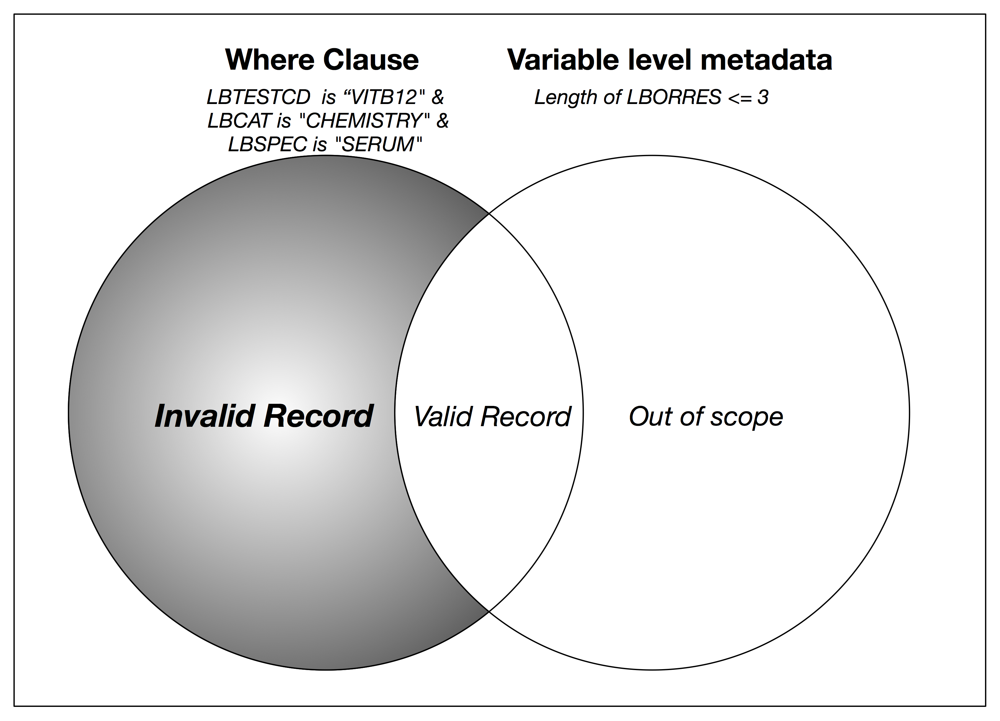
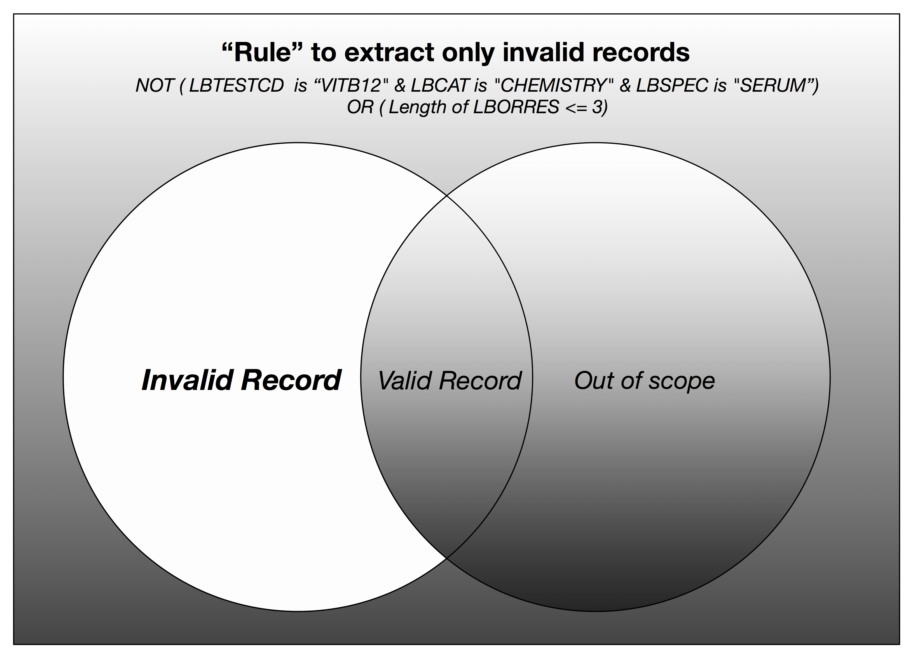
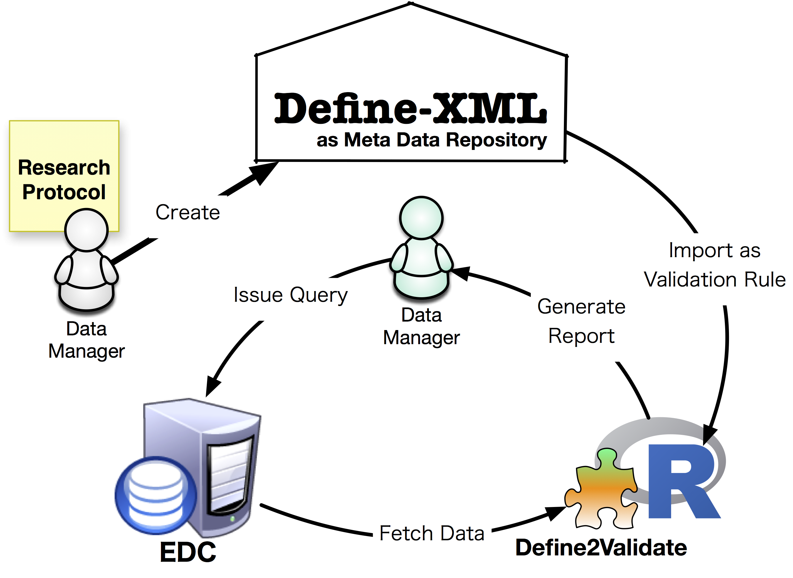
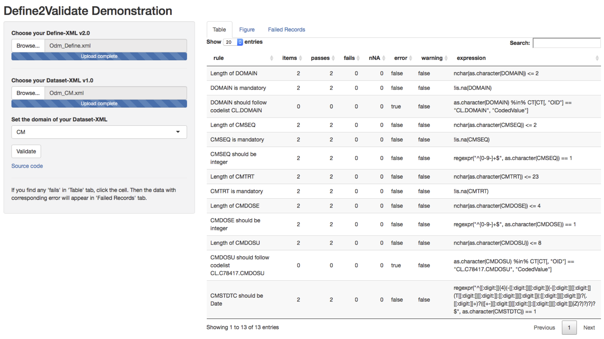

---
output:
 revealjs::revealjs_presentation:
   theme: solarized
   css: D2VIntro.css
#output: word_document
title: Define2Validate - Validate your CDISC dataset with metadata defined in Define-XML
date: 2017.6.14
author: |
  | Masafumi Okada M.D., Ph.D.
  | University Hospital Medical Information Network research center, University of Tokyo.
---
# Introduction

## Why we need Define-XML?

From Define-XML 2.0 Specification document: 

> The purpose of Define-XML is to support the interchange of dataset metadata for clinical research applications in a machine-readable format.

* Define-XML has **machine-readable metadata**.
* Your dataset should be consistent with the metadata defined in Define-XML.
* 'metadata' itself is not exactly a set of rules, but we can interpret typical metadata as the "rules" that your data should follow.

## Where is the definition of metadata?

Typical metadata will be:

| Item     | Variable Name| Variable Type| Length | Terminology|
|----------|--------------|--------------|--------|------------|
| Age|  AGE        | Integer     | 3       | N/A|
|Start Date/Time of Visit|SVSTDTC|Character|25|ISO8601|
|Vitamin B12|VITB12|Integer|3|N/A|


* Metadata for each collected item would be defined in the **protocol document**, of course it was already defined at the beginning of data collection.
* The collected data should be consistent with the metadata defined in protocol document.
* Thus, you can create Define-XML at the same time when the protocol is finalized.

## When we write Define-XML?

* But, actually many users of the Define-XML creates that **after the dataset** is finalized.

* In such case, there are **two** set of metadata for your dataset. One was defined (even roughly) in the protocol document, another is defined in Define-XML.

* These two are **always** consistent?

## The new way to handle the metadata

* To eliminate this potential conflict, this simple workflow is recommended.
    + Create Define-XML **before creating CRF**, ideally at the same time of finalizing the research protocol.
    + Validate whether the collected data is consistent with the metadata defined in the Define-XML **frequently**, ideally EDC system could include this validation feature.

* This is, in another words, treat your Define-XML as your **meta data repository(MDR)**.

## But how...??

* Yes, writing Define-XML now becomes easy, thanks to some of software tools that can convert Excel sheets to XML.
* But I do not know any EDC or CDMS system that supports validating dataset with Define-XML...

* Oh! we have statistical software environment that can read XML and validate the data (and it is also a free software). The name is **R**.
* This is the reason why I write a small software to validate the data with the metadata define in the Define-XML, using R. The name of my software is **Define2Validate**.

## Objective

* To prove the concept of **validating dataset with the metadata defined in Define-XML** *automaticaly* and *concurrently with data collection process*, we developped an open-source tool to validate datasets with corresponding Define-XML.

# Methods

## Components Used

* **R** has so many **extention packages** ( currently > 10000 )!.My tool deeply depends on two packages, '**R4DSXML**' by *Ippei Akiya* and '**validate**' by *Mark van der Loo*.
* With *R4DSXML*, we can import the content of Dataset-XML and Define-XML as the common table format in R (aka DataFrame).
* With *validate*, we can apply a set of checks on any dataset, according to pre-defined rules. The rules can be written in R's ordinary expressions. 
* All of those are licensed under **open-source** licenses.

## Method to implement

* Define-XML consists of four major parts, **Definition of domain**(*ItemGroupDef* elements), **Variable-level metadata**(*ItemDef* elements), **Value-level metadata**(*ValueListDef* elements and *WhereClauseDef* elements),and **Definition of Terminology**(*CodeList* elements).
* *Define2Validate* works per domain. It narrows metadata definitions to the specified domain, then converts each variable-level metadata into 'rules' represneted by R expressions. 

## Method to support value-level metadata

* Value-level metadata can be interpreted as a combination of these two:
    + Where-clause (e.g. When LBTESTCD is "BILI" AND LBCAT is "CHEMISTRY" AND LBSPEC is "BLOOD")
    + Variable-level metadata (e.g. Length of the variable should be smaller or equal to 3.)

* "Valid record" should satisfy both of two condition.

## How the "Valid record" is represented



## Rule to extract invalid records only {.small-image}

* Only invalid records will fail at a rule of logical OR of these two:
    + inverse of "where clause" rule
    + a rule that represents variable-level metadata



# Results

## Example of rules 

```xml
<!-- ORIGINAL Define-XML -->
<ItemDef OID="IT.LB.LBSEQ" Name="LBSEQ" DataType="integer" Length="2"
	SASFieldName="LBSEQ">
	<Description>
		<TranslatedText xml:lang="en">Sequence Number</TranslatedText>
	</Description>
	<def:Origin Type="Derived"/>
</ItemDef>
```

```yaml
# Generated YAML Rule
-
  expr: 'nchar(as.character(LBSEQ)) <= 2'
  name: Length of LBSEQ
-
  expr: '!is.na(LBSEQ)'
  name: LBSEQ is mandatory
-
  expr: 'regexpr("^[0-9-]+$",as.character(LBSEQ)) == 1'
  name: LBSEQ should be integer
```

## Usage - Converting Define-XML

**Define2Validate** is implemented as a function of **R** language for statistical computing.

```{r, echo=FALSE}
suppressMessages(source("define2validate.R"))
```
```{r, eval=TRUE}
Domain <- "LB"
define2validate(domain=Domain,file="exampleRules.yaml", definexml="Odm_Define.xml", overwrite=TRUE)
```

* This call converts specified Define-XML file("Odm_Define.xml") into the "rules" written in R expressions, and stores the rules to "exampleRules.yaml" file.
* Because Dataset-XML is separated by SDTM domain in most cases, *Define2Validate* extracts and converts metadata per SDTM domain.

## Usage - Validating your data

* Once we got "rules" file, we can validate your dataset by *validate* package.

```{r, eval=TRUE}
## Read Rules file by validation package
v <- validator(.file="exampleRules.yaml") 
```
```{r, eval=TRUE, echo=FALSE}
## Make a subset of rules, just due to the limited space in the presentation.
key <- c("VISITDY should be integer" ,"Length of LBBLFL", "Length of BILI(LBORRES)", "BILI(LBORRES) should be float" , "VITB12(LBORRES) should be integer" )
v <- v[names(v) %in% key]
```
```{r}
## Read your Dataset-XML by R4DSXML package.
x <- read.dataset.xml(paste("Odm_", Domain, ".xml", sep=""), "Odm_Define.xml") 
## Read Controlled Terminology Definitions by R4DSXML package.
CT <- getCT("Odm_Define.xml")
## Run Validation 
cf <- confront(x,v)
```

## Validation Results

```{r, echo=FALSE}
options(width=40)
```
```{r}
## Display Results
head(summary(cf))
```

## Graphical Results
```{r, out.width="100%", out.height="70%"}
barplot(cf)
```

# Discussion

## Use Case




## Open-Source License {.small-image}

* All components of Define2Validate are released under GNU General Public License(GPL) or GNU Lesser GPL (LGPL).
* You can freely download or distribute these components, or discuss about improvements with quoting the source code.

 


# Summary

## Key Messages

* We developed an open-source tool that validates dataset with the rules or metadata defined in Define-XML. 
* Define2Validate would provide researchers a simple way to manage their metadata repository, just like that:
    + Create Define-XML first, use it through end-to-end of your research.

## Availability

* Source code:
  https://github.com/mokjpn/Define2Validate
* Live Demonstration:
  https://cuda.umin.ac.jp/s/Define2ValidateDemo/
  

